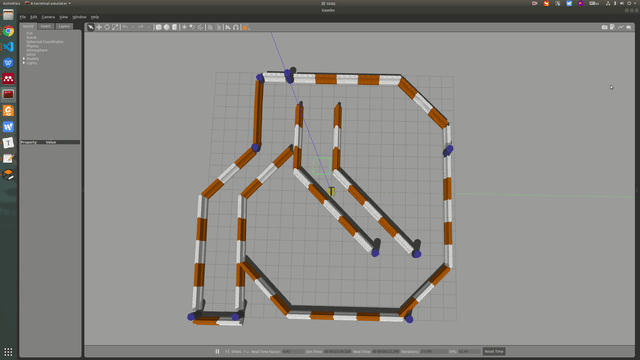
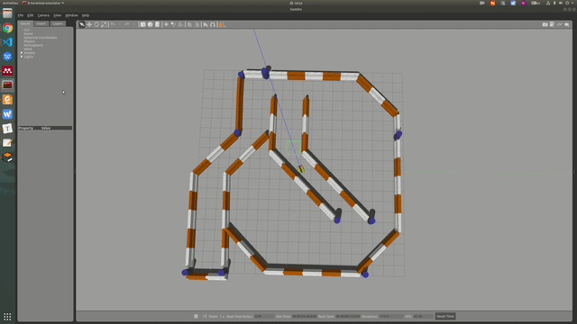

# Scan-to-Map-based Teach and Repeat with Legs Tracker
Teach in simulation:
---



Repeat in simulation:
---




Introduction
---

It's a scan-to-map-based T&R system. In the teaching step, it will record build a map by `GMapping` and store all "keyposes" (pose in the global map). In the repeating step, it will use `AMCL` to get the current localization, then combining with "keyposes", realizing the repeating process.

In teach step:
- Input: odometry, 2d scan, and joystick
- Output: Map, keyposes

In repeat step: 
- Input: odometry, 2d scan, joystick, map and keyposes
- Output: cmd_vel

Hardware
---

A sony joystick:


Software
---

Follow [dingo-simulation](https://www.clearpathrobotics.com/assets/guides/melodic/dingo/simulation.html) to install dingo relative packages:
```bash
mkdir -p ~/catkin_ws/src
cd ~/catkin_ws
catkin_init_workspace src
cd src
git clone https://github.com/dingo-cpr/dingo.git
git clone https://github.com/dingo-cpr/dingo_simulator.git
git clone https://github.com/dingo-cpr/dingo_desktop.git
cd ..
rosdep install --from-paths src --ignore-src
catkin_make
source devel/setup.bash
```

Install cpp relative packages:
- OpenCV
- Eigen3

How to use
---

For simulation:
```bash
# write these codes to the ~/.bashrc
export DINGO_JOY_DEV=/dev/input/js0
export DINGO_LASER=1  # help DINGO model to open laser sensor
export DINGO_OMNI=1  # here, we use Omni-directional DINGO
```
```bash
rosocre
# teach
# go to config/teach.yaml to modify parameters
roslaunch dingo_gazebo dingo_world.launch config:=front_laser
roslaunch dingo_navigation gmapping_demo.launch  # make sure that your topic name is true
roslaunch laser-teach-repeat teach.launch
# repeat
# # go to config/repeat.yaml to modify parameters
# re-open dingo_gazebo
roslaunch dingo_navigation amcl_demo.launch map_file:=/home/jing/ws_tr/src/laser_teach_repeat/data/map.yaml initial_pose_x:=0 initial_pose_y:=0 initial_pose_a:=0
rosrun laser-teach-repeat repeat.launch
```
- Circle button: begin to teach
- Cha button: save keyposes and the map
- Triangle button: begin the repeating process
- TODO: improve the repeating speed because current PD-control-based repeating is really slow

For real world experiments:

- Teaching with a joystick, it's similar to the simulation process. Being careful with sensor and ROS topics!

